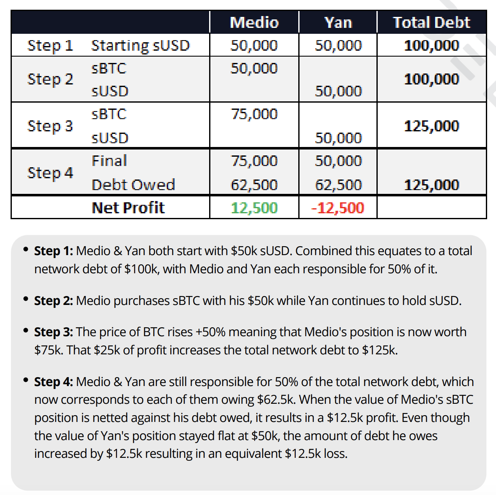

## Basic Steps
- Rewards are calculated and made available once per week on Wednesdays.
- Use <a class="link" target="_blank" href="https://staking.synthetix.io/">staking.synthetix.io</a> to navigate to the `Claim` section.
- Ensure that your collateralization ratio is high enough to claim: the required ratio is 600%, but if you're within 1% (i.e., above ~594%), you'll be able to claim. If not, you'll have to <a href="/docs/buying-snx" class="link"> buy more SNX</a> or <a href="/docs/transferring-snx#burning-susd" class="link">burn sUSD</a> to restore your `C-RATIO`.
- Press `Claim Now` to collect both your sUSD and SNX weekly rewards.
- As of the Hadar release, you'll have to claim every week. After the fee period has ended, your rewards will be pooled back in with the communal rewards pool.
- Claimed SNX rewards are `escrowed` for 1 year. You won't be able to transfer or sell them.

There is a <a class="link" target="_blank" href="https://github.com/Synthetixio/SIPs/issues/58">current proposed SIP</a> to make rewards calculation dynamic and phase out the snapshot model, in favor of time-based rewards.

## Managing Debt
Your `C-RATIO` can change without any direct action by you. There's a <a href="https://help.synthetix.io/hc/en-us/articles/360023174973-Why-does-my-total-sUSD-debt-fluctuate-over-time-" target="_blank" class="link">detailed explanation here</a> on why global debt fluctuates over time. In simple terms, the global debt - and your pro rata slice of it - will increase if traders on Synthetix Exchange are profitable and decrease if they are unprofitable.

As of February 2020, the vast majority of traders on Synthetix are long `sETH` and `sBTC`, synthetic ether and bitcoin. There's a section called `Synths Distribution` on the <a href="https://dashboard.synthetix.io/" class="link" target="_blank">Synthetix Dashboard</a> with up-to-date stats on positioning. 

A common strategy to keep your positioning fairly stable is to use the sUSD you've minted to mirror the global positioning of traders. Your debt will increase if the portfolio does well, but your synth value will increase in constant terms, protecting your positioning. You may have to burn some synths to restore your C-RATIO, but you won't be at economic loss. 

If a staker mints sUSD and doesn't trade it, they are effectively short the global portfolio, because they're exposed to an increase in global debt without a potential increase in synth holdings. There's nothing wrong with this market positioning, but some beginner stakers don't realize that they're exposed to the global portfolio.

<a href="https://www.delphidigital.io/research" target="_blank" class="link">Delphi Research</a> has a series of detailed examples on the system's debt mechanics in their report on SNX (behind paywall). See one below:

## How are rewards calculated?
There are two components to rewards: sUSD and SNX.

When a trader transacts on Synthetix Exchange, they pay a 0.3% fee. Those fees are distributed pro rata, to all stakers.

The more sUSD you've minted, the higher proportion of fees you'll receive. 

Global SNX rewards are determined by the SNX inflation schedule. As of February 2020, 90% of weekly inflation is allocated toward staking rewards. More on Synthetix's <a class="link" target="_blank" href="https://blog.synthetix.io/synthetix-monetary-policy-changes/">monetary policy here</a>. 

If you are below the target `C-RATIO`, you will not be penalized. You just won't be able to claim your rewards.

Your proportion of global debt is calculated based on a `snapshot` of the network taken every Wednesday at roughly 09:00 UTC.

## Calculating Returns
Returns are a function of Synthetix Exchange volume, the current inflation schedule, and an individual staker's proportion of global minted debt. <a href="https://www.stakingrewards.com/asset/synthetix-network-token" class="link" target="_blank">Staking Rewards</a> provides an approximation of expected SNX returns, but it may not include the value of sUSD returns.

